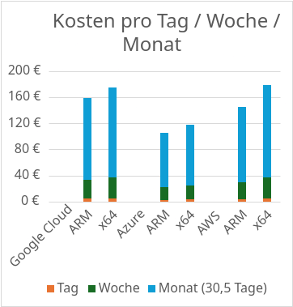
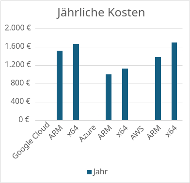
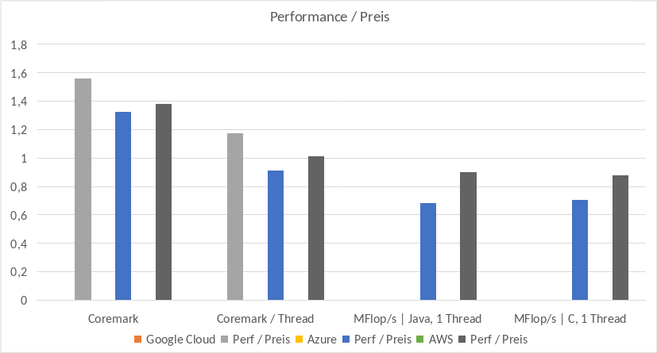

# Dokumentation: ARM on the Cloud

- [Dokumentation: ARM on the Cloud](#dokumentation-arm-on-the-cloud)
- [Motivation](#motivation)
- [Problemstellung](#problemstellung)
- [Verfügbarkeit bei Providern](#verfügbarkeit-bei-providern)
- [Experiment (Vergleich in der Praxis)](#experiment-vergleich-in-der-praxis)
  - [Konfiguration der Instanzen](#konfiguration-der-instanzen)
  - [Auswahl eines Programm für Benchmarking](#auswahl-eines-programm-für-benchmarking)
  - [Aufsetzen des Experiments](#aufsetzen-des-experiments)
      - [Installation von PerfKitBenchmarker am lokalen System \[22\]](#installation-von-perfkitbenchmarker-am-lokalen-system-22)
    - [Installation der CLI-Tools pro Cloud-Provider \[22\]](#installation-der-cli-tools-pro-cloud-provider-22)
    - [Anmeldung über die Konsole \[22\]](#anmeldung-über-die-konsole-22)
  - [Konfiguration der Benchmarks](#konfiguration-der-benchmarks)
    - [**PerfKitBenchmarker Bug für Azure Bps-Instanzen**](#perfkitbenchmarker-bug-für-azure-bps-instanzen)
    - [Google Cloud ARM Tests](#google-cloud-arm-tests)
  - [Ergebnisse](#ergebnisse)
- [Einschränkungen bei der Verwendung](#einschränkungen-bei-der-verwendung)
- [Erwähnenswerte Erkenntnisse, Tools und Herausforderungen](#erwähnenswerte-erkenntnisse-tools-und-herausforderungen)
- [Konklusion](#konklusion)
- [Inhalt des Repositories](#inhalt-des-repositories)
- [Referenzen](#referenzen)


# Motivation

Eine der wichtigsten Messwerte in der Cloud ist Effizienz. Effiziente Nutzung von Ressourcen ist notwendig um anfallende Kosten zu reduzieren. Ein klassischer Punkt an dem die Effizienz von Computer verbessert werden kann ist die CPU. Klassische Prozessoren der x32/x64 Architektur bieten guten Performanze auf Kosten von hohen Stromverbrauch. Eine Alternative dazu bieten ARM-Prozessoren.

ARM Prozessoren bieten eine vergleichbare Performanze zu x32/x64 Prozessoren, mit einer geringeren Anzahl an verwendeten Transistoren und Instruktionen [1]. Ihr Design ist dabei Optimiert um den Stromverbrauch zu minimieren, wodurch sie sich für den Einsatz in Rechenzentren eignen. Zusätzlich bieten sie auch eine höhere Anzahl an Registern, im Vergleich zu x32/x64 Prozessoren. Dadurch können Anwendungen durch Caching weiter Optimiert werden.

# Problemstellung

Welche Cloud-Provider bieten bereits ARM basierte Services an?

Welche Services werden auf ARM-Architektur angeboten?

Welchen Performance pro Kosten / Watt kann man im Vergleich zu x32/x64 CPUs erwarten?

Welche Einschränkungen gibt es durch z.B. die geringere Anzahl an Instruktionen?

<div class="page"/>

# Verfügbarkeit bei Providern

|                 | Produkt                                                                                                           | Varianten                               |
| --------------- | ----------------------------------------------------------------------------------------------------------------- | --------------------------------------- |
| Google Cloud    | Google Compute Engine                                                                                             | C4A VM [2]                              |
|                 |                                                                                                                   | Tau-TA2 VM [3]                          |
|                 | Google Kubernetes Engine [4]                                                                                      |                                         |
| Microsoft Azure | Virtual Machine                                                                                                   | Dpsv5 [5]                               |
|                 |                                                                                                                   | Dpsv6 [6]                               |
|                 |                                                                                                                   | Bpsv2 [7]                               |
|                 |                                                                                                                   | Epsv5 [8]                               |
|                 |                                                                                                                   | Andere VMs mit p als zweiten Buchstaben |
|                 | Azure Kubernetes Service [9]                                                                                      |                                         |
| AWS             | EC2 [10]                                                                                                          | AWS Graviton 2 / 3 / 4 [10]             |
|                 | [App Mesh](https://aws.amazon.com/app-mesh/)  [11]                                                                |                                         |
|                 | [Aurora](https://aws.amazon.com/rds/aurora/) [11]                                                                 |                                         |
|                 | [Batch](https://aws.amazon.com/batch/) [11]                                                                       |                                         |
|                 | [CodeBuild](https://aws.amazon.com/codebuild/) / [CodeCatalyst](https://codecatalyst.aws/) [11]                   |                                         |
|                 | [DocumentDB](https://aws.amazon.com/documentdb/) / [MemoryDB](https://aws.amazon.com/memorydb/) [11]              |                                         |
|                 | [ECR](https://aws.amazon.com/ecr/) / [ECS](https://aws.amazon.com/ecs/) / [EKS](https://aws.amazon.com/eks/) [11] |                                         |
|                 | [Elastic Beanstalk](https://aws.amazon.com/elasticbeanstalk/) [11]                                                |                                         |
|                 | [EMR](https://aws.amazon.com/emr/) [11]                                                                           |                                         |
|                 | [RDS](https://aws.amazon.com/rds/) [11]                                                                           |                                         |
|                 | [Lambda](https://aws.amazon.com/lambda/) [11]                                                                     |                                         |
|                 | And some more [11]                                                                                                |                                         |

<div class="page"/>

# Experiment (Vergleich in der Praxis)

Benchmark-Frage: Erhalte ich mit einer ARM-Instanz einen besseren Preis zur Performance, relativ zu einer Intel / AMD Instanz?

## Konfiguration der Instanzen

Datum der Erfassung für den Preis: 22.01.2025. Inkludiert keine Rabatte für langfristige Reservierung.

| Instanz-Einstellungen |                                                                                                                     |
| --------------------- | ------------------------------------------------------------------------------------------------------------------- |
| **Instanz-Arten**     | VMs welche von den Betreibern als "general purpose" beworben werden und sowohl ARM als auch x64 Instanzen anbieten. |
| **Betriebssystem**    | Ubuntu 24.04-LTS                                                                                                    |
| **vCPU-Kerne**        | 4                                                                                                                   |
| **Google Cloud**      |                                                                                                                     |
| - Verwendete Zone     | - us-central1-c                                                                                                     |
| - ARM Instanz         | - c4a-standard-4 [2]                                                                                                |
| - GHz                 | - 3 GHz [15]                                                                                                        |
| - Preis / h           | - 0,1725€ / h                                                                                                       |
| - x64-Instanz         | - c4-standard-4 [14]                                                                                                |
| - GHz                 | - 3.1 GHz / 4 GHz                                                                                                   |
| - Preis / h           | - 0,1898€ / h                                                                                                       |
| **Microsoft Azure**   |                                                                                                                     |
| - Verwendete Zone     | - eastus2                                                                                                           |
| - ARM Instanz         | - Standard_B4pls_v2 [7]                                                                                             |
| - GHz                 | - 3 GHz                                                                                                             |
| - Preis / h           | - 0,114€ / h                                                                                                        |
| - x64-Instanz         | - Standard_B4als_v2 [16]                                                                                            |
| - GHz                 | - 3.5 GHz                                                                                                           |
| - Preis / h           | - 0,128€ / h                                                                                                        |
| **AWS**               |                                                                                                                     |
| - Verwendete Zone     | - us-east-2a                                                                                                        |
| - ARM Instanz         | - m7g.xlarge [17]                                                                                                   |
| - GHz                 | - 2.7 GHz [19]                                                                                                      |
| - Preis / h           | - 0,1567€ / h                                                                                                       |
| - x64-Instanz         | - m7i.xlarge [18]                                                                                                   |
| - GHz                 | - 3.2 GHz                                                                                                           |
| - Preis / h           | - 0,1936€ / h                                                                                                       |

**Note:** Die aktuellen ARM-Prozessoren aller Anbieter unterstützen kein Simultaneous Multi-Threading (SMT). Jede vCPU entspricht daher einem physischen Kern. Im Gegensatz zu den x64-Prozessoren, bei welchen die vCPUs einzelnen Threads entsprechen können. z.B.: Google Cloud [14].

<div class="page"/>

## Auswahl eines Programm für Benchmarking

Es gibt viele verschiedene Benchmarking-Programme welche entweder für Anwendungen oder verschiedene Teile eines Systems ausgelegt sind. Folgende Werkzeuge mit ARM-Unterstützung wurden betrachtet:

- **7z**
    - Einfach zu Verwenden mit guter Metrik-Ausgabe.
    - https://7zip.bugaco.com/7zip/MANUAL/cmdline/commands/bench.htm
- **stress-ng**
    - Gut um hohe Systemauslastung auf verschiedene Arten zu simulieren.
    - https://github.com/ColinIanKing/stress-ng
- **phoronix-test-suite**
    - Viele verschiedene unterstützte Tests und integriert auch andere Tools z.B. stress-ng. 
Umfassende aber auch wuchtige Dokumentation. 
    - https://github.com/phoronix-test-suite/phoronix-test-suite
- **aperf**
    - Tool für Benchmarking von konkreten Cloud-Anwendungen. Unterstützt von Amazon.
    - https://github.com/aws/aperf
    - https://github.com/aws/aws-graviton-getting-started/blob/main/perfrunbook/README.md

Letztendlich viel die Entscheidung jedoch auf **PerfKitBenchmarker** **v1.15.1** [20]. Ein Werkzeug von Google welches explizit für das Benchmarking von Cloud-Instanzen beliebiger Anbieter entwickelt wurde. PerfKitBenchmarker kümmert sich um automatische Provisonierung, Setup und Teardown der Instanzen. Die Daten der durchgeführten Tests werden dabei danach auf der ausführenden Maschine gespeichert. Unterstützt werden verschiedene Tests für Auslastung von CPU, Arbeitsspeicher, Festplatte, Netzwerk sowie Web-Services und NoSQL Datenbanken.

<div class="page"/>

## Aufsetzen des Experiments

#### Installation von PerfKitBenchmarker am lokalen System [22]

**Notiz:** Aufsetzen von PerfKitBenchmarker benötigt Python 3.11+. Python 3.13 wird aktuell wegen einer entfernten Abhängigkeit nicht mehr unterstützt. (https://github.com/GoogleCloudPlatform/PerfKitBenchmarker/issues/5518)

```bash
# Note: Requires Python 3 to be installed
# Download and create venv
git clone https://github.com/GoogleCloudPlatform/PerfKitBenchmarker.git
python -m venv PerfKitBenchmarker/.venv
source PerfKitBenchmarker/.venv/bin/activate

# Install generall and AWS dependencies
pip install -r PerfKitBenchmarker/requirements.txt
pip install -r PerfKitBenchmarker/perfkitbenchmarker/providers/aws/requirements.txt
```

### Installation der CLI-Tools pro Cloud-Provider [22]

**Google Cloud**

```bash
# Note: Requires Python 3
curl -O https://dl.google.com/dl/cloudsdk/channels/rapid/downloads/google-cloud-cli-linux-x86_64.tar.gz
tar -xf google-cloud-cli-linux-x86_64.tar.gz

#Install interactive, requires user inputs
./google-cloud-sdk/install.sh
```

**Microsoft Azure**

Die Installation ist sehr Plattform-Spezifisch und besitzt kein generisches Installations-Script was mit der aktuellen Python 3 Version funktioniert. Instruktionen für die jeweilige Plattform: https://learn.microsoft.com/en-us/cli/azure/install-azure-cli

Von mir verwendetes Skript liegt im Github-Repository in der Datei **install_azure_cli_arch_linux.sh**.

**AWS**

Die AWS Abhängigkeiten sollten bereits mit PerfKit installiert worden sein. Die CLI ist verfügbar, nachdem die **venv** geladen wurde.

```bash
source PerfKitBenchmarker/.venv/bin/activate
```

### Anmeldung über die Konsole [22]

Bevor die Benchmarks auf einem Provider ausgeführt werden können, muss man sich in den lokal in dem jeweiligen CLI anmelden.

**Google Cloud**

Bei der ersten Anmeldung muss der Account initialisiert werden. Dafür wird die [Google Cloud Console](https://console.developers.google.com) benötigt.

```bash
gcloud init
```

Danach kann man sich mit dem folgenden Befehl jederzeit erneut anmelden:

```bash
gcloud auth login
```

Bei beiden Befehlen wird ein Browser-Fenster für die Anmeldung geöffnet.

**Microsoft Azure**

Login in Microsoft-Azure erfolgt über einen einzelnen Befehl welcher ein Fenster im Browser öffnet:

```bash
az login
```

Beim Login muss dabei die korrekte Azure-Subscription gewählt werden. Danach kann mit folgenden Befehlen geprüft werden ob die notwendigen Berechtigungen verfügbar sind. 

```bash
az provider register -n Microsoft.Compute
az provider register -n Microsoft.Network

# Alternativ falls die Befehle einen Timeout haben:
az provider show -n Microsoft.Compute | more
az provider show -n Microsoft.Network | more
```

**AWS**

In der AWS Konsole muss ein Acces-Key konfiguriert werden: [https://console.aws.amazon.com/ec2/](https://console.aws.amazon.com/ec2/)

- Klick auf den Namen in der Konsole (Oben Links)
- Klick auf "Security Credentials"
- Klick auf"Access Keys" zur Erstellung eines neuen Schlüssels. Sowohl "Access key" als auch "Secret access key" werden benötigt. Diese werte gehören entweder gespeichert oder als CSV heruntergeladen.

Danach kann folgender Befehl zur Anmeldung aufgerufen werden. Dabei muss die **venv** aktiviert sein!

```
$ aws configure
```

"AWS Access Key ID" entspricht dabei dem "Access Key" aus dem UI.

## Konfiguration der Benchmarks

Folgende Benchmarks wurden für das Experiment ausgewählt [21]:

- `coremark`
    - Ebenfalls von Google für Tests der Instanzen verwendet
    - Verschiedene realistische Operationen für Anwendungen
        - Listen-Operationen, Matrix-Berechnung, State-Machine
        - Implementiert in C
        - Bietet vergleichbaren Messwert für CPU-Performance
    - https://github.com/eembc/coremark
    - https://github.com/GoogleCloudPlatform/PerfKitBenchmarker/blob/v1.15.1/perfkitbenchmarker/linux_benchmarks/coremark_benchmark.py
- `scimark2`
    - Verschiedene Wissenschaftliche Berechnungen zur Schätzung der Mflops (Million flops / s) eines Systems
    - Implementiert in Java und C
    - Bietet vergleichbaren Messwert für CPU-Performance
    - https://math.nist.gov/scimark2/
    - https://github.com/GoogleCloudPlatform/PerfKitBenchmarker/blob/v1.15.1/perfkitbenchmarker/linux_benchmarks/scimark2_benchmark.py

Für die Benchmarks wird eine Konfiguration als YAML-Datei angelegt. Darin wird für jeden Cloud-Provider festgelegt Typ der Instanz, OS-Image und Zone festgelegt. Die einzelnen Konfigurationswerte müssen dabei dem Provider-Spezifischen Format entsprechen. Es existiert je eine Konfigurations-Datei für x64 und ARM. Die Tests selbst werden entweder auf dem Gerät gebaut oder verwenden Plattform unabhängig Sprachen.

**Anmerkung:** Die Provider-Spezifische Konfiguration ist selbst bei Google Cloud, als Entwickler des Tools, nicht so einfach herauszufinden. Sie benötigte daher einige versuche und Durchforstung der Dokumentation. Google Cloud selbst hat kein Image angegeben, da es standardmäßig Ubuntu 24.04 verwendet. Außerdem gelang es mir nicht, das korrekte Format für die API herauszufinden. Das Format in der Beispiel-Konfiguration funktionierte in meinen Durchläufen nicht.

<div class="page"/>

**Beispiel x64_config.yaml:**

```yaml
coremark:
    description: Run Coremark a simple processor benchmark
    vm_groups:
        default:
            vm_spec:
                GCP:
                    machine_type: c4-standard-4
                    zone: us-central1-c
                Azure:
                    machine_type: Standard_B4als_v2
                    image: Ubuntu2404
                    zone: eastus
                AWS:
                    machine_type: m7i.xlarge
                    image: ami-0cb91c7de36eed2cb
                    zone: us-east-2a

scimark2:
    description: Runs SciMark2
    vm_groups:
        default:
            vm_spec:
                GCP:
                    machine_type: c4-standard-4
                    zone: us-central1-c
                Azure:
                    machine_type: Standard_B4als_v2
                    image: Ubuntu2404
                    zone: eastus
                AWS:
                    machine_type: m7i.xlarge
                    image: ami-0cb91c7de36eed2cb
                    zone: us-east-2a
```

<div class="page"/>

Für die eigentliche Ausführung der Tests existieren einzelne Shellscripts. Diese entsprechen dabei immer dem gleichen Format. Einziger Unterschied ist der konfigurierte Cloud-Provider sowie die jeweilige Architektur.

```bash
#!/usr/bin/env bash
# Beispiel: run_x64_google.sh

# Should be executed within the root of the repository
CLOUD=GCP
ARCH=x64
NUM_RUNS=2
RUN_URI=$(uuidgen | head -c8)
PERFKIT_PATH=PerfKitBenchmarker
CONFIG_PATH="configs/${ARCH}_config.yaml"
OUTPUT_FILE="runs/${CLOUD}_${ARCH}_$(date +%FT%T).json"

RESULTS_FILE="/tmp/perfkitbenchmarker/runs/${RUN_URI}/perfkitbenchmarker_results.json"

# Enable venv
source $PERFKIT_PATH/.venv/bin/activate

echo "Cloud: ${CLOUD} - Arch: ${ARCH}"
echo "Executing bechmarks..."
$PERFKIT_PATH/pkb.py --cloud=$CLOUD \
                     --benchmarks=coremark,scimark2 \
                     --benchmark_config_file=$CONFIG_PATH \
                     --num_benchmark_copies="$NUM_RUNS" \
                     --run_uri="$RUN_URI"
                                            
echo "Copying results..."
echo "From: ${RESULTS_FILE}"
echo "To: ${OUTPUT_FILE}"
cp $RESULTS_FILE $OUTPUT_FILE
```

<div class="page"/>

### **PerfKitBenchmarker Bug für Azure Bps-Instanzen** 

PerfKitBenchmarker besitzt einen Fehler in Azure. Die ARM-Instanzen Bps können nicht mit **trusted-launch** gestartet werden. Das ist im Code jedoch nicht Hinterlegt. Dieser Fehler wurde von mir manuell im Code behoben. Ansonsten kann ist es nicht möglich eine ARM-Instanz mit meinen Einstellungen zu starten.

**In PerfKitBenchmarker/perfkitbenchmarker/provider/azure/azure_virtual_machine.py**

```python
> Ab Zeile 132
# Reference -
# https://learn.microsoft.com/en-us/azure/virtual-machines/trusted-launch#virtual-machines-sizes
TRUSTED_LAUNCH_UNSUPPORTED_TYPES = [
    r'(Standard_A[0-9]+_v2)',
    r'(Standard_[DE][0-9]+_v[2-3])',
    r'(Standard_M[0-9]+.*)',
    r'(Standard_ND[0-9]+a.*)',
    # Example: Standard_B4pls_v2
    r'(Standard_B[0-9]+pl?d?s_v2)', # Code welcher den Fehler behebt
    # Arm V5
    r'(Standard_[DE][0-9]+pl?d?s_v5)',
]
> Restlicher Code
```

<div class="page"/>

### Google Cloud ARM Tests

Der scimark2 Benchmark blieb bei Google Cloud auf ARM zu jedem Versuch stecken. Auch nach mehreren Stunde wurde der Test nicht beendet. Dieser Vergleich ist daher für Google Cloud nicht vorhanden.

## Ergebnisse

Es wird der durchschnittliche Wert aller Durchläufe für eine Instanz-Art verwendet.

**Kosten pro Instanz basierend auf stündlichen Kosten (Stundenpreis von 22.01.2025)**

| Kosten pro            | Stunde      | Tag         | Woche       | Monat (30,5 Tage) | Jahr        |
| --------------------- | ----------- | ----------- | ----------- | ----------------- | ----------- |
| **Google Cloud**      |             |             |             |                   |             |
| - **ARM**             | 0,17 €      | 4,14 €      | 28,98 €     | 126,27 €          | 1.511,10 €  |
| - **x64**             | 0,19 €      | 4,56 €      | 31,89 €     | 138,93 €          | 1.662,65 €  |
| - ARM vs x64          | - 0,02 €    | - 0,42 €    | - 2,91 €    | - 12,66 €         | - 151,55 €  |
| - Relativer ARM Preis | 0,894736842 | 0,907894737 | 0,908748824 | 0,908874973       | 0,908850329 |
| **Azure**             |             |             |             |                   |             |
| - **ARM**             | 0,11 €      | 2,74 €      | 19,15 €     | 83,45 €           | 998,64 €    |
| - **x64**             | 0,13 €      | 3,07 €      | 21,50 €     | 93,70 €           | 1.121,28 €  |
| - ARM vs x64          | - 0,01 €    | - 0,34 €    | - 2,35 €    | - 10,25 €         | - 122,64 €  |
| - Relativer ARM Preis | 0,846153846 | 0,892508143 | 0,890697674 | 0,890608324       | 0,890625    |
| **AWS**               |             |             |             |                   |             |
| **ARM**               | 0,16 €      | 3,76 €      | 26,33 €     | 114,70 €          | 1.372,69 €  |
| - **x64**             | 0,19 €      | 4,65 €      | 32,52 €     | 141,72 €          | 1.695,94 €  |
| - ARM vs x64          | - 0,04 €    | - 0,89 €    | - 6,20 €    | - 27,01 €         | - 323,24 €  |
| - Relativer ARM Preis | 0,842105263 | 0,808602151 | 0,809655597 | 0,809342365       | 0,809397738 |




Die Kosten sprechen eindeutig für eine Verwendung von ARM-Instanzen. Sie sind durchgängig niedriger, auch ohne jegliche Rabatte durch Reservierung. (Unter der Annahme, dass die Performance mindestens gleich ist.)

<div class="page"/>

**Gemessene Performance: Coremark**

|                             | Coremark    | Coremark (1 Thread) |
| --------------------------- | ----------- | ------------------- |
| **Google Cloud**            |             |                     |
| - ARM                       | 123754,7186 | 31025,54973         |
| - x64                       | 87207,88951 | 28940,33976         |
| - ARM vs x64                | 1,419077096 | 1,072052021         |
| - Relativer Preis / Monat   | 0,908874973 |                     |
| - Perf. / Relativer Preis   | 1,561355674 | 1,179537398         |
| **Azure**                   |             |                     |
| - ARM                       | 88276,8362  | 22086,27682         |
| - x64                       | 74697,28338 | 27113,87764         |
| - ARM vs x64                | 1,181794467 | 0,814574629         |
| - Relativer Preis / Monat   | 0,890608324 |                     |
| - Perf. / Relativer Preis   | 1,326951967 | 0,914627235         |
| **AWS**                     |             |                     |
| - ARM                       | 97187,63358 | 24301,33774         |
| - x64                       | 86751,06117 | 29641,20747         |
| - ARM vs x64                | 1,120304839 | 0,819849791         |
| - Relativer Preis / Monat\n | 0,809342365 |                     |
| - Perf. / Relativer Preis\n | 1,384216232 | 1,012982671         |

Der normale Coremark Score ist bei den ARM-Instanzen durchgehend höher als bei den x64-Instanzen. Somit können normale Programme eindeutig von ARM-Instanzen profitieren. Sowohl in Performance, als auch in Kosten.

Der Single-Thread-Score war überraschend. Durch das fehlende Multithreading der ARM-Instanzen dachte ich, dass hier der Wert höher sein sollte. Die relative Performance ist bei Google und AWS über 1. Die Nutzung dieser Instanz spart somit insgesamt Geld ein, trotz schlechteren Werten.

<div class="page"/>

**Gemessene Performance: Scimark2**

|                             | MFlop/s in Java, 1 Thread | MFlop/s in C, 1 Thread |
| --------------------------- | ------------------------- | ---------------------- |
| **Azure**                   |                           |                        |
| - ARM                       | 1778,622585               | 2064,86                |
| - x64                       | 2902,496476               | 3275,9975              |
| - ARM vs x64                | 0,61279061                | 0,630299626            |
| - Relativer Preis / Monat   | 0,908874973               |                        |
| - Perf. / Relativer Preis   | 0,68805848                | 0,707718095            |
| **AWS**                     |                           |                        |
| - ARM                       | 2106,7978                 | 2551,03                |
| - x64                       | 2874,72574                | 3570,8825              |
| - ARM vs x64                | 0,732869147               | 0,714397631            |
| - Relativer Preis / Monat\n | 0,809342365               |                        |
| - Perf. / Relativer Preis\n | 0,905511905               | 0,882689035\n          |

Bei den wissenschaftlichen Berechnungen schneiden die ARM-Instanzen sowohl in Performance als auch Preis schlechter ab. Grund dafür könnten die reduzierten Instruktionen. Mathematische Operationen wie Matrix-Berechnungen können in x64 CPUs durch eigene Instruktionen optimiert werden. Diese sind jedoch bei RISC-CPUs nicht vorhanden. Hier könnte der Code jedoch möglicherweise für ARM weiter optimiert werden, um die Performance-Einbußen zu umgehen.

**Relativer Performance zu Preis**



(Zu Legende: Perf / Preis gehört zu dem jeweiligen davor stehenden Provider)

# Einschränkungen bei der Verwendung

Generell

- Sowohl Betriebssystem-Images als auch Software-Versionen müssen eigene Builds für ARM-Prozessoren bereitstellen.
- Eigene Docker Images müssen für ARM-Plattformen gebaut werden. Das kann jedoch auch auf x64-Systemen durchgeführt werden. Mithilfe von Virtualisierung ist auch das Testen dieser Images möglich. [12]
- Eigene Build Systeme, verwendete Bibliotheken und Tools müssen ebenfalls die ARM-Plattform unterstützen. Für die Code-Migration existiert ein AWS Tool welches Python, Java, Go und C/C++ Code auf mögliche Probleme prüft. [12]

Google Cloud

- Keine verschachtelte Virtualisierung
- Tau-TA2 [2]
    - Kein Windows
    - Keine dedizierten Instanzen
    - Keine lokalen SSDs / Extreme Persistence / Regionale Disks
- Keine SAAS angebote.

Microsoft Azure

- Keine verschachtelte Virtualisierung
- Keine [Ephemeral OS Disk](https://learn.microsoft.com/en-us/azure/virtual-machines/ephemeral-os-disks) (Lokale Festplatten)
- Keine SAAS angebote
- Kein Trusted Launch möglich

AWS

- Keine Windows-Images

<div class="page"/>

# Erwähnenswerte Erkenntnisse, Tools und Herausforderungen

**ARM Unterstützung der einzelnen Provider**

AWS versucht bereits aktiv Kunden auf die ARM-Plattform zu migrieren. Sie bieten einen einfachen Überblick über alle ARM-Instanzen und bereits damit verfügbaren Services. Zusätzlich bieten sie auch noch Entwickler-Guides an für Optimierung in verschiedenen Programmiersprachen sowie Migration der eigenen Services. Die neuste VM-Serie (M8) ist außerdem nur als ARM-Instanzen verfügbar.

Bei Google und Azure existiert hingegen keine Dokumentation über alle ARM-Services. Diese werden nur in einzelnen Blog-Posts oder Dokumentationsseiten beschrieben.

**Google Cloud Entdeckungen**

**https://gcloud-compute.com/:** Diese Seite ist ein tolles Tool um eine Übersicht über die verfügbaren Google Cloud Instanzen zu erhalten. Dabei werden sowohl Kosten und Verfügbarkeit, als auch technische Daten übersichtlich aufgelistet.

Google Cloud bietet außerdem die Möglichkeit eine SSH Verbindung zu einer Instanz über den Browser zu öffnen. Dadurch lassen sich Anomalien in den Tests leicht erkennen.

**Azure-Dokumentation Herausforderungen**

Es ist teilweise unglaublich schwer grundlegende Informationen für Azure herauszufinden. Beispielsweise habe ich Stunden damit verbracht, nur um den korrekten String für Images auf Azure herauszufinden. Dieser Name ist weder in der Dokumentation, dem Azure-Portal oder dem Marktplatz ersichtlich. Die Abfrage ist einzig über die Azure-CLI möglich, diese braucht jedoch teilweise Minuten für ein Ergebnis.

Ein weiteres Problem ist, dass die Azure Resource Templates kurz geschrieben ebenfalls als ARM abgekürzt werden. Dadurch ergeben alle Suchanfragen zur ARM-Architektur automatisch viele falsche Ergebnisse zurück.

**AWS Herausforderungen**

AWS Amis entsprechen der jeweiligen Zone in der man sich befindet. Die Zone in der UI muss dabei extra geändert werden. Ansonsten stimmen die AMI-Werte der Images in der Übersicht nicht zwingend mit der Zone welche in der Konsole verwendet werden zusammen.

**PerfKitBenchmarker Herausforderungen**

PerfKitBenchmarker funktioniert insgesamt sehr gut, bietet jedoch wenig konkrete Dokumentation außerhalb von Beispielen für AWS und Google Cloud. Vieles musste selbst herausgefunden, z.B.: Welche konkreten Werte für Images angegeben werden müssen. Diese müssen dabei den Werten in der jeweiligen Cloud Provider API entsprechen. Doch selbst bei Google Cloud sind sie nicht einfach herauszufinden da die Beispiele aus dem Repo in meinem Fall nicht funktioniert haben.

<div class="page"/>

# Konklusion

ARM CPUs habe die grundsätzlich das Potential die Kosten um bis zu 40% einzusparen. Der konkrete Wert unterscheidet sich jedoch bei jeder Anwendung. Vor der Einscheidung zu einer ARM-Instanz sollte somit ein Profiling der Antwort auf diesen Instanzen durchgeführt werden.

AWS sieht die Cloud-Zukunft in ARM. Viele SAAS Angebote von AWS sind bereits basierend auf ARM verfügbar. Amazon bietet außerdem ebenfalls Guides für Migration, Optimierung und Benchmarking auf ARM an. Die neueste Maschinen-Serie (M8) außerdem aktuell nur auf ARM verfügbar.

Die Tests selbst haben Aufgrund der kurzen Dauer keine Kosten produziert. 

# Inhalt des Repositories

Im Zuge des Projekts erstellte Skripte und Auswertungen sind auf GitHub verfügbar:
[https://github.com/Pystronic/clc3-arm-testing](https://github.com/Pystronic/clc3-arm-testing "https://github.com/Pystronic/clc3-arm-testing") 


Inhalt:

- Skripte zur Installation von PerfkitBenchmarker und CLI-Tools
- Skripte und Config zur Reproduktion der Benchmarks
- Ergebnisse der Testläufe
- Auswertung
- Code-Änderung bezüglich Bug auf Azure
- Präsentation


<div class="page"/>

# Referenzen

1. Ryzhyk, Leonid. (2006). The ARM Architecture. 
2. https://cloud.google.com/compute/docs/general-purpose-machines?#c4a_series
3. https://cloud.google.com/compute/docs/general-purpose-machines#t2a_machines
4. https://cloud.google.com/kubernetes-engine/docs/concepts/arm-on-gke
5. https://learn.microsoft.com/en-us/azure/virtual-machines/sizes/general-purpose/dpsv5-series?tabs=sizebasic
6. https://learn.microsoft.com/en-us/azure/virtual-machines/sizes/general-purpose/dpsv6-series?tabs=sizebasic
7. https://learn.microsoft.com/en-us/azure/virtual-machines/sizes/general-purpose/bpsv2-series?tabs=sizebasic
8. https://learn.microsoft.com/en-us/azure/virtual-machines/sizes/memory-optimized/epsv5-series?tabs=sizebasic
9. https://learn.microsoft.com/en-us/azure/aks/create-node-pools#arm64-node-pools
10. https://aws.amazon.com/de/ec2/graviton/
11. https://github.com/aws/aws-graviton-getting-started/blob/main/managed_services.md
12. https://www.docker.com/blog/multi-platform-docker-builds/
13. https://github.com/aws/porting-advisor-for-graviton
14. https://cloud.google.com/compute/docs/general-purpose-machines?#c4_series
15. https://gcloud-compute.com/c4a-standard-8.html
16. https://learn.microsoft.com/en-us/azure/virtual-machines/sizes/general-purpose/basv2-series?tabs=sizebasic
17. https://aws.amazon.com/de/ec2/instance-types/m7g/
18. https://aws.amazon.com/de/ec2/instance-types/m7i/
19. https://community.arm.com/arm-community-blogs/b/high-performance-computing-blog/posts/leading-hpc-performance-with-graviton4
20. https://github.com/GoogleCloudPlatform/PerfKitBenchmarker
21. https://meteorfox.github.io/PerfKitBenchmarker/documentation/benchmarks/linux-benchmarks/
22. https://github.com/GoogleCloudPlatform/PerfKitBenchmarker/tree/master/perfkitbenchmarker/provider

